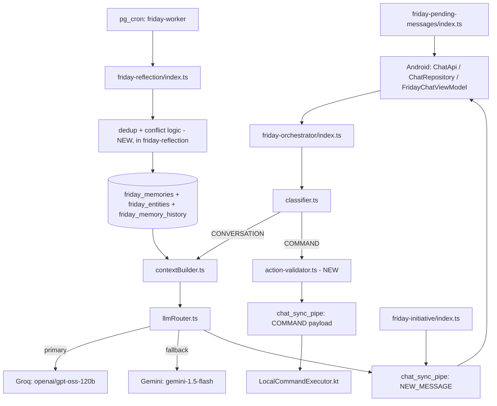

# FridayV1 — Final Architecture & Execution Spec

*Single source of truth. Reconciled against the live codebase audit (`friday_review.md`). Written to be handed to an implementation agent directly — every new component below has an exact contract, not just a description.*

---

## 1. Purpose & Scope

FRIDAY's core loop is live: `friday-orchestrator` (chat), `friday-reflection` (background memory extraction), `friday-initiative` (proactive outreach), and `LocalCommandExecutor.kt` (device actions). This document is the final, precise spec for the remaining work — memory scoring/lifecycle, deduplication, action validation, rate limiting, and one P0 security fix (`access_keys` exposure) — written so an agent can implement it without needing to ask what a table, function, or threshold should be.

Nothing here proposes replacing working code. Every new piece slots into the existing structure named exactly as it exists today.

## 2. As-Built Architecture



## 3. Full Component Reference (as-built)

### Android
| Component | Role |
|---|---|
| `ChatApi.kt`, `ChatRepository.kt` | Chat network layer |
| `FridayChatViewModel.kt` (extends `ChatRoomViewModel.kt`) | FRIDAY chat state |
| `MessageDto` | `id, conversation_id, sender_id, receiver_id, content, created_at, read_at, is_deleted, reactions, reply_to_id, reply_to_content, reply_to_sender_id, delivered_at, is_pinned` — human-to-human chat |
| `FridayMessageDto` | `id, owner_id, sender ("user"\|"friday"), message, created_at, is_pinned, is_deleted, reactions` |
| `SyncPipeDto` | `recipient_id, payload, created_at` — `payload` carries `NEW_MESSAGE`, `DELETE_MESSAGE`, `START_TYPING`, `COMMAND` |
| `AppDatabase.kt`, `MessageDao.kt`, `MessageEntity.kt` | Local Room cache |
| `SyncWorker` | Periodic (15 min), wishlist offline sync — unrelated to FRIDAY |
| `ChatSyncWorker` | One-time, flushes pending chat messages on connectivity |
| `LocalCommandExecutor.kt` | Executes `play_music(genre)`, `navigate(destination)`, `set_timer(minutes)`, `set_alarm(hour, minute)` |
| `AuthManager.kt` | Validates passkey against `access_keys`, returns persona ID (`phesty_official` / `baroness_official`) |
| `GroqApiService.kt` | Calls Groq directly from the client using an embedded key, for translation + `AskFridaySheet` analysis. **Decision: leave untouched** — this key belongs to a mock/test account, not a production credential, so the exposure risk is accepted. Do not move, rotate, or refactor this. |

### Edge Functions (Deno, `std@0.168.0/http/server.ts`, `@supabase/supabase-js@2`)
| Function | Responsibility | Model(s) used |
|---|---|---|
| `friday-orchestrator/index.ts` | Chat entry point: lock, typing indicator, classify, build context, route model, compute reply delay, respond via realtime | see below |
| `friday-orchestrator/classifier.ts` | Classifies `COMMAND` vs `CONVERSATION` | Groq `openai/gpt-oss-20b`, temp 0.1, JSON mode |
| `friday-orchestrator/contextBuilder.ts` | Assembles prompt: persona → temporal context → `friday_vibe` → self-facts (`friday_entities` where `relationship='Self'`) → matched entity notes → vector-matched memories → last 20 messages | Gemini `gemini-embedding-001`, 768-dim |
| `friday-orchestrator/llmRouter.ts` | Groq primary, Gemini fallback, static message if both fail | Groq `openai/gpt-oss-120b` (temp 0.6, max_tokens 1024); Gemini `gemini-1.5-flash` (temp 0.7, maxOutputTokens 150) |
| `friday-orchestrator/personality.ts` | `getPersonalityBlock(userName)` — base persona text | — |
| `friday-reflection/index.ts` | Background extraction from messages where `reflected_at IS NULL` | Gemini `gemini-3.5-flash` (structured JSON), `gemini-embedding-001` |
| `friday-initiative/index.ts` | Proactive check-ins after 12–18h silence, using `follow_up_worthy` memories | Groq `openai/gpt-oss-120b`, temp 0.9 |
| `friday-pending-messages/index.ts` | REST: fetch pending FRIDAY messages for `user_id` since a timestamp | — |
| `notify-trigger/index.ts` | DB trigger on `wishlist_items` inserts → FCM push | — |

## 4. Database — Current Schema + Required Migrations

### Current tables (unchanged, for reference)
`profiles(id text, display_name, persona, avatar_url, fcm_token, friday_vibe)` · `friday_messages(id uuid, owner_id text, sender, message, created_at, session_id uuid, reflected_at, is_pinned, is_deleted, reactions jsonb, reply_to_id uuid, status, is_proactive, is_command, sentiment)` · `friday_memories(id bigint, owner_id text, memory_text, emotion_tag, is_pinned, created_at, category, embedding vector(768), session_id uuid, follow_up_worthy)` · `friday_entities(id uuid, owner_id text, name, aliases text[], relationship, last_known_fact, updated_at, created_at)` · `messages`, `chat_sync_pipe`, `access_keys`, `backup_log`, `typing_status`. Extensions enabled: `vector`, `pg_cron`.

### Required migrations (run in order)

```sql
-- 001_memory_scoring.sql
alter table friday_memories
  add column if not exists importance smallint not null default 3 check (importance between 1 and 5),
  add column if not exists confidence smallint not null default 3 check (confidence between 1 and 5),
  add column if not exists status text not null default 'active'
    check (status in ('candidate','validated','active','reinforced','updated','stale','archived')),
  add column if not exists last_reinforced_at timestamptz;

create index if not exists idx_friday_memories_owner_category_status
  on friday_memories(owner_id, category, status);
```

```sql
-- 002_memory_history.sql
create table if not exists friday_memory_history (
  id uuid primary key default gen_random_uuid(),
  memory_id bigint not null references friday_memories(id) on delete cascade,
  change_type text not null check (change_type in ('created','reinforced','updated','superseded','archived')),
  previous_text text,
  reason text,
  changed_at timestamptz not null default now()
);
alter table friday_memory_history enable row level security;
-- No client-facing policy — service role only (Supabase service_role bypasses RLS by default).
```

```sql
-- 003_sessions.sql
create table if not exists friday_sessions (
  id uuid primary key default gen_random_uuid(),
  owner_id text not null references profiles(id),
  started_at timestamptz not null default now(),
  ended_at timestamptz,
  summary text,
  status text not null default 'active' check (status in ('active','ended'))
);
create index if not exists idx_friday_sessions_owner_status on friday_sessions(owner_id, status);
alter table friday_sessions enable row level security;
```

```sql
-- 004_action_requests.sql
create table if not exists friday_action_requests (
  id uuid primary key default gen_random_uuid(),
  owner_id text not null references profiles(id),
  session_id uuid references friday_sessions(id),
  action_name text not null,
  parameters jsonb not null,
  status text not null default 'dispatched' check (status in ('dispatched','executed','failed','rejected')),
  created_at timestamptz not null default now()
);
alter table friday_action_requests enable row level security;
```

```sql
-- 005_api_usage.sql
create table if not exists friday_api_usage (
  owner_id text not null references profiles(id),
  provider text not null check (provider in ('groq','gemini')),
  day date not null default current_date,
  call_count integer not null default 0,
  primary key (owner_id, provider, day)
);
alter table friday_api_usage enable row level security;
```

```sql
-- 006_security_p0.sql
-- Revoke public read on the passkey table — anon clients can currently read secret_key.
drop policy if exists "Allow public select" on access_keys;
-- Leave RLS enabled with no policy: only the service-role key (used inside the
-- passkey-verification path server-side) can read this table going forward.
```

None of the four new tables (`friday_memory_history`, `friday_sessions`, `friday_action_requests`, `friday_api_usage`) get a client-facing PostgREST policy. The Android app never queries these directly today — it only talks to `friday-orchestrator` and `friday-pending-messages` — so this closes exposure without touching client code.

## 5. Short-Term Memory — Precise Spec

- **Session boundary**: a message starts a new session if the owner's most recent prior message is more than **30 minutes** old (same threshold `friday-reflection` already uses for idle detection — kept consistent). On a new session: insert a `friday_sessions` row (`status='active'`), mark the previous one `status='ended', ended_at=now()`.
- **Window**: `contextBuilder.ts` currently pulls the last 20 raw messages. Change to: last **15** raw messages, plus `friday_sessions.summary` for the current session if it exists.
- **Summary trigger**: once a session passes 20 messages, summarize everything except the most recent 15 into 2–4 sentences (cheap Groq call, `openai/gpt-oss-20b`) and write to `friday_sessions.summary`. On later triggers within the same session, **extend** the existing summary with only the newly-aged-out messages — never regenerate from the full history.
- **Interaction with long-term memory**: unchanged — short-term context is always included; long-term is retrieved conditionally (§8).

## 6. Long-Term Memory — Categories & Extraction Contract

Keep the five existing categories as canonical: `preference`, `emotional_moment`, `life_event`, `recurring_pattern`, `entity_link`. No renaming, no new categories added preemptively (see §20 if a real gap shows up in use).

`friday-reflection`'s Gemini structured-output schema, updated to emit the new scoring fields:

```json
{
  "entities": [
    { "name": "string", "aliases": ["string"], "relationship": "string", "fact": "string" }
  ],
  "memories": [
    {
      "category": "preference | emotional_moment | life_event | recurring_pattern | entity_link",
      "content": "string",
      "emotionTag": "string | null",
      "importance": 1,
      "confidence": 1,
      "followUpWorthy": false,
      "supersedes": "string | null"
    }
  ],
  "vibe": "chilled | hyped | salty | concerned | playful | null"
}
```

`supersedes` is a short description of the prior fact this contradicts (e.g. `"used Spotify"`), filled in by the model when the transcript shows a contradiction — it's the input to §7's conflict resolution.

## 7. Memory Deduplication & Conflict Resolution — Exact Algorithm

Runs inside `friday-reflection/index.ts`, per candidate, after its embedding is generated (reuses the embedding already computed for storage — no new embedding call needed):

```
for each candidate in extracted.memories:
  1. neighbors = select id, memory_text, importance, confidence, status
       from friday_memories
       where owner_id = :owner_id and category = candidate.category and status = 'active'
       order by embedding <=> candidate.embedding asc
       limit 3

  2. nearest = neighbors[0], distance = cosine distance to nearest

  3. if distance < 0.15:
       # same fact, restated — reinforce, don't duplicate
       update friday_memories set
         confidence = least(confidence + 1, 5),
         last_reinforced_at = now()
       where id = nearest.id
       insert into friday_memory_history (memory_id, change_type, reason)
         values (nearest.id, 'reinforced', 'restated in session')
       # do not insert a new row

  4. else if candidate.supersedes is not null and distance < 0.45:
       # likely contradiction of an existing fact in the same category
       update friday_memories set status = 'stale' where id = nearest.id
       insert into friday_memory_history (memory_id, change_type, previous_text, reason)
         values (nearest.id, 'superseded', nearest.memory_text, candidate.supersedes)
       insert into friday_memories (owner_id, memory_text, category, emotion_tag, embedding,
         importance, confidence, status, follow_up_worthy, session_id)
         values (..., status='active', ...)

  5. else:
       # genuinely new
       insert into friday_memories (..., status='active', ...)
```

Distance thresholds (0.15 / 0.45) are starting points — log every dedup/conflict decision (§16) for the first couple of weeks and tune if reinforcement or false-contradiction rates look off.

## 8. Memory Retrieval — Exact Ranking

`contextBuilder.ts` already does vector search (`match_friday_memories` RPC) + entity matching. Add a re-ranking pass **in TypeScript, after** the RPC call — no SQL/RPC changes needed:

```
1. Fetch top 15 candidates from match_friday_memories (existing RPC, unchanged) where status='active'.
2. For each candidate, compute:
     recency_days = days since coalesce(last_reinforced_at, created_at)
     recency_score = exp(-recency_days / 30)
     importance_score = importance / 5
     vector_score = 1 - cosine_distance   (already returned by the RPC)
     final_score = 0.6 * vector_score + 0.25 * importance_score + 0.15 * recency_score
3. Sort by final_score desc, take top 6.
4. Always additionally include: friday_entities where relationship = 'Self' (identity facts — unchanged behavior).
```

## 9. Memory Lifecycle

```
candidate → validated → active → reinforced → (stale on contradiction) → archived
```

| State | Set by |
|---|---|
| `active` | Default on insert (post-dedup, §7 step 5) |
| `reinforced` | Not a separate stored status in v1 — confidence bump + `friday_memory_history` row is sufficient; `status` stays `active` |
| `stale` | §7 step 4, on contradiction |
| `archived` | Manual/cron sweep of `stale` rows older than ~90 days (optional, not required for launch) |

## 10. Personality System (final, unchanged)

`personality.ts` (`getPersonalityBlock`) is the base voice; `profiles.friday_vibe` (`chilled`/`hyped`/`salty`/`concerned`/`playful`, updated by `friday-reflection`'s `vibe` field from §6) is the dynamic layer. No `personality_config` table. `GroqApiService.kt`'s separate analyst persona ("You are Friday, the Baroness Analyst...") stays scoped to that one feature — do not merge it into the main chat persona.

## 11. Model Routing (confirmed, as-built)

| Task | Provider | Model | Params |
|---|---|---|---|
| Reply | Groq (primary) → Gemini (fallback) | `openai/gpt-oss-120b` → `gemini-1.5-flash` | temp 0.6/1024 tok → temp 0.7/150 tok |
| Classification | Groq | `openai/gpt-oss-20b` | temp 0.1, JSON mode |
| Extraction | Gemini | `gemini-3.5-flash` | structured JSON schema |
| Embeddings | Gemini | `gemini-embedding-001` | 768-dim |
| Proactive outreach | Groq | `openai/gpt-oss-120b` | temp 0.9 |
| Session summary (new) | Groq | `openai/gpt-oss-20b` | temp 0.3, short output |

## 12. Action System — Exact Contract

Flow: `classifier.ts` detects `COMMAND` → **`action-validator.ts` (new)** checks it → on pass, insert `friday_action_requests` row and push to `chat_sync_pipe` → `LocalCommandExecutor.kt` executes (unchanged). On fail, `friday-orchestrator` falls through to a normal conversational reply asking for clarification instead of dispatching anything.

The allowlist **must exactly mirror `LocalCommandExecutor.kt`** — any action added to one side without the other breaks silently.

## 13. New File Specifications

All new files live in `supabase/functions/_shared/` (new directory) unless noted.

**`_shared/types.ts`**
```ts
export type ActionParamType = 'string' | 'number' | 'boolean';

export interface ActionParameterSchema {
  type: ActionParamType;
  required: boolean;
  min?: number;
  max?: number;
}

export interface ActionDefinition {
  name: string;
  parameters: Record<string, ActionParameterSchema>;
  confirmationRequired: boolean;
}

export interface ClassifierResult {
  type: 'COMMAND' | 'CONVERSATION';
  intent?: string;
  parameters?: Record<string, unknown>;
}

export interface ValidationResult {
  valid: boolean;
  action?: { intent: string; parameters: Record<string, unknown> };
  reason?: string;
}
```

**`_shared/action-schema.ts`** — mirrors `LocalCommandExecutor.kt` exactly:
```ts
import { ActionDefinition } from './types.ts';

export const ACTION_ALLOWLIST: Record<string, ActionDefinition> = {
  play_music: { name: 'play_music', parameters: { genre: { type: 'string', required: false } }, confirmationRequired: false },
  navigate:   { name: 'navigate',   parameters: { destination: { type: 'string', required: true } }, confirmationRequired: false },
  set_timer:  { name: 'set_timer',  parameters: { minutes: { type: 'number', required: true, min: 1, max: 1440 } }, confirmationRequired: false },
  set_alarm:  { name: 'set_alarm',  parameters: { hour: { type: 'number', required: true, min: 0, max: 23 }, minute: { type: 'number', required: true, min: 0, max: 59 } }, confirmationRequired: false },
};
```

**`_shared/action-validator.ts`** — behavior spec (implement to this contract):
```ts
import { ClassifierResult, ValidationResult } from './types.ts';
import { ACTION_ALLOWLIST } from './action-schema.ts';

export function validateAction(raw: ClassifierResult): ValidationResult {
  // 1. raw.type !== 'COMMAND' -> { valid:false, reason:'not a command' }
  // 2. raw.intent not a key of ACTION_ALLOWLIST -> { valid:false, reason:'unknown action' }
  // 3. definition = ACTION_ALLOWLIST[raw.intent]
  // 4. for each [key, schema] of definition.parameters:
  //      value = raw.parameters?.[key]
  //      if schema.required and value === undefined -> invalid, reason: `missing ${key}`
  //      if value !== undefined:
  //        typeof value !== schema.type -> invalid, reason: `${key} wrong type`
  //        schema.min !== undefined && value < schema.min -> invalid
  //        schema.max !== undefined && value > schema.max -> invalid
  // 5. cleaned = pick only the keys declared in definition.parameters (drop anything extra)
  // 6. return { valid:true, action:{ intent: raw.intent, parameters: cleaned } }
}
```

**`_shared/rate-limiter.ts`** — behavior spec:
```ts
// checkAndIncrement(ownerId, provider, dailyLimit):
//   1. upsert friday_api_usage (owner_id, provider, day=current_date)
//      on conflict (owner_id, provider, day) do update set call_count = friday_api_usage.call_count + 1
//      returning call_count
//   2. return { allowed: call_count <= dailyLimit, remaining: dailyLimit - call_count }
// Call at the top of llmRouter.ts before the Gemini call at minimum.
// Daily limits: set via env vars GEMINI_DAILY_LIMIT / GROQ_DAILY_LIMIT.
// Confirm current free-tier request-per-day limits in each provider's console before
// setting these — they change over time and are not hardcoded here.
```

**`_shared/logger.ts`** — behavior spec:
```ts
// logEvent(event: string, meta: object):
//   Allowed fields: owner_id, session_id, model, latency_ms, action_name,
//     memory_category (name only), success (boolean), error_code,
//     prompt_tokens, completion_tokens, total_tokens.
//   Never log: message text, memory_text content, raw LLM output, action parameter values.
//   Emit as a single JSON line: { event, ...meta, ts: new Date().toISOString() }
//
// Token usage is mandatory on every LLM call log, not optional:
//   - Groq responses (OpenAI-compatible) return `usage.prompt_tokens` /
//     `usage.completion_tokens` / `usage.total_tokens` — pull these directly.
//   - Gemini responses return `usageMetadata.promptTokenCount` /
//     `candidatesTokenCount` / `totalTokenCount` — map to the same three fields.
//   - Every call site that hits Groq or Gemini (llmRouter.ts, classifier.ts,
//     contextBuilder.ts's embedding call, friday-reflection/index.ts,
//     friday-initiative/index.ts) must pass these three fields into logEvent.
//     This is for cost/capacity planning, not debugging — treat it as required,
//     not best-effort.
```

**Changes to existing files** (not new files, but must be wired in):
- `friday-orchestrator/classifier.ts`: after producing a `ClassifierResult`, call `validateAction()`; on `valid:false`, return a `CONVERSATION`-style fallback instead of dispatching; on `valid:true`, insert into `friday_action_requests` (status `dispatched`) before pushing to `chat_sync_pipe`.
- `friday-orchestrator/llmRouter.ts`: call `rate-limiter.checkAndIncrement` before the Gemini fallback call; if not allowed, skip straight to the static fallback message and log it.
- `friday-orchestrator/contextBuilder.ts`: implement §5 (window=15 + session summary) and §8 (re-ranking) here.
- `friday-reflection/index.ts`: implement §7 (dedup/conflict) after embedding generation, before insert.

## 14. Security — Fixes Required

| Priority | Issue | Fix | Where |
|---|---|---|---|
| **P0 — urgent, check now** | Migration `006_security_p0.sql` (or its renumbered equivalent) revoked public `SELECT` on `access_keys`. If `AuthManager.kt` currently validates passkeys by querying `access_keys` directly via PostgREST, **login is now broken in production** — this must be verified immediately. | Build `verify-passkey` (new Edge Function, service-role only): validates the passkey against `access_keys` server-side, and on success mints a JWT signed with the project's `SUPABASE_JWT_SECRET` containing `{ role: 'authenticated', persona: 'phesty_official' \| 'baroness_official', sub: persona, exp }`. `AuthManager.kt` calls this function instead of querying `access_keys` directly, and uses the returned JWT as the client's Supabase session token for all subsequent calls. | `AuthManager.kt`, new `supabase/functions/verify-passkey/index.ts` |
| Resolved | `GROQ_API_KEY`/`GROQ_API_KEY_1` embedded in APK, used by `GroqApiService.kt` | **No action.** Confirmed to be a mock/test account key, not a production credential — risk accepted. Do not touch `GroqApiService.kt`, `build.gradle.kts`, or `local.properties` as part of this work. | — |
| P1 | `profiles`, `friday_messages`, `friday_memories`, `chat_sync_pipe` RLS is `QUAL: true` (public) | **Decided: keep the existing passkey system as-is (`phesty_official`/`baroness_official`), no Supabase Auth migration.** Once `verify-passkey` (above) is issuing signed JWTs, replace the public policies with: `using (owner_id = (auth.jwt() ->> 'persona'))` / matching `with check` clauses. This works because any JWT signed with the project's `SUPABASE_JWT_SECRET` is accepted by Supabase's `auth.jwt()` regardless of whether the subject exists in `auth.users` — no auth.users migration needed. | RLS policies |
| P1 | No rate limiting despite multiple LLM calls per message | §13 `rate-limiter.ts` | `llmRouter.ts` |
| P2 | No action audit trail | §13, `friday_action_requests` writes | `classifier.ts` |
| P2 | No tests | §18 | new test files |

## 15. Failure Modes

| Situation | Behavior |
|---|---|
| Groq unavailable | `llmRouter.ts` falls back to Gemini; if both fail, static in-character message |
| Gemini unavailable | `friday-reflection` retries on next `pg_cron` tick (messages stay `reflected_at IS NULL`) |
| Both LLMs unavailable | Static fallback reply; message still saved, nothing lost |
| Rate limit hit | `rate-limiter.ts` returns `allowed:false` → skip to static fallback, log the event |
| Invalid/malformed action JSON | `action-validator.ts` rejects → falls through to conversational clarification, no dispatch |
| Duplicate memory candidate | §7 step 3 — reinforced, not duplicated |
| Contradictory memory | §7 step 4 — old marked `stale`, linked via `friday_memory_history` |
| Ambiguous command | Classifier should default to `CONVERSATION` when confidence is low rather than force a command (verify current `classifier.ts` behavior on ambiguous input as part of §18 testing) |
| Reflection job fails mid-run | Messages stay `reflected_at IS NULL` — safe to retry, no partial memory writes because dedup/insert happens per-candidate after full parsing |

## 16. Observability

Use `_shared/logger.ts` (§13) everywhere. Minimum events to log: `chat.reply` (model, latency, success, token usage), `chat.action_dispatched` (action_name, validation result), `reflection.run` (candidates found/reinforced/superseded/new, token usage), `rate_limit.blocked` (provider, owner_id). **Every LLM call log must include `prompt_tokens`/`completion_tokens`/`total_tokens`** (§13) — this is what makes §17's cost planning and the free-tier limit decision in §20 answerable from real data instead of guesswork. Never log message or memory text content (§13).

## 17. Cost & Rate Limiting

- Reuse embeddings already computed at extraction time for dedup (§7) — no additional embedding calls introduced.
- Session summary calls are cheap (`openai/gpt-oss-20b`, short output) and only fire once per ~20-message threshold, not per message.
- `rate-limiter.ts` protects the tighter constraint (Gemini) first; extend to Groq only if you see it becoming the bottleneck in practice.

## 18. Testing Strategy

| Test | What it checks |
|---|---|
| `action-validator.test.ts` | Valid action passes; missing required param fails; out-of-range `hour`/`minute` fails; unknown `intent` fails; extra unexpected params are stripped, not passed through |
| Dedup smoke test | Feed two near-identical statements in separate sessions → confirm one `friday_memories` row, confidence incremented, `friday_memory_history` has a `reinforced` entry |
| Conflict smoke test | Feed a preference, then an explicit contradiction (e.g. "switched from X to Y") → confirm old row `status='stale'`, new row `active`, history has a `superseded` entry |
| Classifier ambiguity test | Feed a handful of ambiguous phrasings → confirm they default to `CONVERSATION`, not a false-positive `COMMAND` |
| RLS isolation test (post §14 P1 fix) | Confirm one persona's Postgrest queries never return the other persona's rows |
| Rate limiter test | Simulate hitting `dailyLimit` → confirm fallback path triggers and no over-limit call is made |

## 19. Implementation Plan — Ordered

**Migration hygiene**: never edit a migration file that has already been applied to any real database — the migration runner tracks applied files, so editing history either does nothing or causes drift between what the file says and what's actually in the DB. Fixes to an already-applied migration always get a new forward migration file.

| Step | Work | Depends on |
|---|---|---|
| 1 | Run migrations 001–006 (§4) | — |
| 2 | Verify login still works after `access_keys` lockdown; build `verify-passkey` + RLS via `auth.jwt()`(§14) | Step 1 |
| 3 | Add `_shared/` with `types.ts`, `action-schema.ts`, `action-validator.ts` (§13) | — |
| 4 | Wire `action-validator.ts` + `friday_action_requests` writes into `classifier.ts` (§12, §13) | Step 3 |
| 5 | Add `_shared/rate-limiter.ts`; wire into `llmRouter.ts` (§13, §17) | Step 1, 3 |
| 6 | Implement session boundary + summary logic in `contextBuilder.ts` (§5) | Step 1 |
| 7 | Implement re-ranking in `contextBuilder.ts` (§8) | Step 1 |
| 8 | Implement dedup/conflict logic in `friday-reflection/index.ts` (§7) | Step 1 |
| 9 | Update `friday-reflection`'s extraction JSON schema to include `importance`/`confidence`/`followUpWorthy`/`supersedes` (§6) | Step 8 |
| 10 | Wire token-usage logging (§13, §16) into every LLM call site | Steps 4–9 |
| 11 | Write tests from §18, plus an end-to-end regression check of existing chat/action flows | Steps 3–10 |

## 20. Decisions

1. **Auth model** — *Resolved:* keep the custom passkey system with `phesty_official`/`baroness_official` exactly as they are. No Supabase Auth migration. §14's `verify-passkey` + `auth.jwt()` approach implements this without changing either persona identifier.
2. **Client-side Groq usage** — *Resolved:* leave `GroqApiService.kt` exactly as-is; its key is a mock/test account used only for translation and `AskFridaySheet` analysis, and the exposure risk is accepted. No implementation work should touch this.
3. **Memory categories** — *Recommendation: keep the current five as-is for now.* The gap that "interaction style" would have covered (slang, dialect, verbosity) is already handled dynamically by `personality.ts`'s per-message dialect/energy matching rather than as a stored fact — adding a category for something the personality layer already does live would be redundant. Revisit only if you notice FRIDAY genuinely forgetting a specific, stable preference (e.g. "always reply in one line") that doesn't fit the existing five.
4. **Free-tier limits** — *Recommendation:* don't block on confirming exact provider numbers before launch. Set conservative placeholders now (`GEMINI_DAILY_LIMIT=1000`, `GROQ_DAILY_LIMIT=5000` — deliberately cautious, not verified figures) and let the token-usage logging from §13/§16 show you real daily consumption within the first week. Tighten or loosen the env vars once you have that data instead of guessing twice.
5. **Dedup thresholds** — *Recommendation: keep 0.15/0.45 as shipped* — they've already passed the dedup/conflict test suite. Don't tune them speculatively; wait for a couple of weeks of real `friday_memory_history` entries from actual conversations, then adjust only if you see clear false positives (reinforcing things that weren't really the same) or false negatives (duplicate memories slipping through as new).

## 21. Sign-off

This is the final version of the design: every new table has exact DDL, every new file has an exact interface or behavior contract, every threshold has a stated default, and every decision in §20 is now resolved — either by explicit choice or by a clear recommendation. Nothing remains blocked on a pending call.