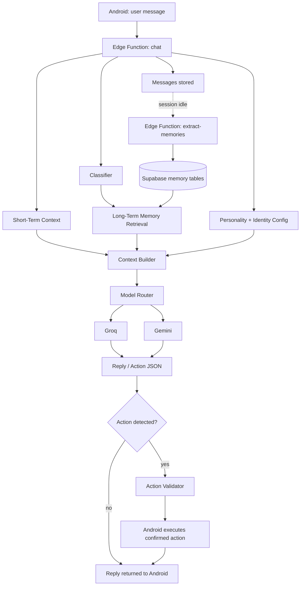
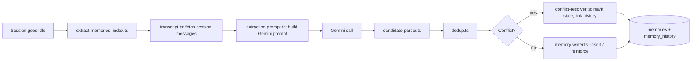
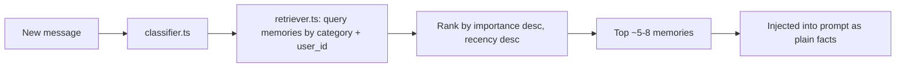

# FRIDAY — Human-Like AI Memory, Personality & Android Action Architecture

*A design document for FRIDAY's backend intelligence: memory, personality, and action logic running on Supabase + Groq/Gemini. The existing Kotlin app is treated as a thin client that sends messages and executes confirmed actions — it is referenced only where it has to be.*

---

## 1. Executive Summary

FRIDAY is not a chatbot bolted onto a database. She is a **person-shaped backend system**: a stable identity/personality plus a curated memory store that a set of Supabase Edge Functions assemble into a prompt on every message, and update in the background after every session.

Four concerns, kept separate:

1. **Identity/Personality** — who FRIDAY is, independent of any one conversation.
2. **Memory** — short-term (session) and long-term (persistent, curated) stores.
3. **Context assembly** — how identity + memory + the current message become one prompt.
4. **Action detection** — how conversational intent becomes a validated, structured action request that your Android app then executes.

Everything here lives server-side (Edge Functions + Postgres). The Android app's job is narrow: send the message, render the reply, execute a confirmed action, and call the extraction trigger when a session goes idle — that's the entire Kotlin surface area this design touches.

## 2. Project Goals

- Feel like a person with continuity, not a stateless assistant.
- Remember selectively — importance-scored, not "log everything."
- Reference memory naturally; never say "according to my records."
- Run entirely on Groq + Gemini free tiers and Supabase free tier.
- Support two private users only, with hard data isolation.
- Emit a fixed set of structured actions safely; never arbitrary code.
- Be debuggable without logging private conversation content by default.

## 3. Design Principles

| Principle | Meaning |
|---|---|
| Identity is separate from memory | Personality is config, not re-derived from stored facts every time. |
| Memory is curated, not comprehensive | A background process decides what's worth keeping. |
| Retrieval is selective | Only memories relevant to the current message enter the prompt. |
| Contradictions resolve, don't accumulate | New facts supersede old ones instead of coexisting. |
| Actions are declarative, not executable code | FRIDAY emits structured intent; validation decides what's allowed. |
| Free-tier first | Every choice should work with zero paid infrastructure before assuming otherwise. |
| The backend is the product | Kotlin is an integration surface, not where FRIDAY's intelligence lives. |

## 4. System Architecture



Almost everything in this box is Supabase Edge Functions and Postgres. Android only appears twice: sending the message in, and executing an already-validated action out.

## 5. FRIDAY Identity Architecture

```
CORE IDENTITY  +  PERSONALITY  +  USER PROFILE  +  SHORT-TERM CONTEXT  +  LONG-TERM MEMORY  +  CURRENT MESSAGE
       = FRIDAY RESPONSE
```

| Layer | What lives here | Storage | Mutability |
|---|---|---|---|
| Core identity | Name, non-negotiable boundaries, voice constraints | Static config | Fixed at design time |
| Personality | Humor style, tone defaults, slang tendencies | `personality_config` table | Rarely changes, edited by you |
| User profile | Name, nicknames, stable preferences | Long-term memory, category `identity`/`preference`, always injected | Updates via extraction pipeline |
| Short-term context | Last N messages + rolling summary of this session | `conversation_sessions.summary` | Per-session, expires |
| Long-term memory | Relationships, projects, habits, events | `memories` table | Reinforced/updated/archived |
| Current message | The literal new user input | N/A | N/A |

## 6. Short-Term Memory

- **Window**: last **10–15 raw messages** verbatim. Beyond that, summarize instead of appending more raw turns.
- **Rolling summary**: past ~15–20 messages, generate a 2–4 sentence running summary (cheap Groq call) covering topic, open questions, referents, tone. Extend it incrementally rather than re-summarizing from scratch each time.
- **Reference resolution** ("she", "that thing", "yesterday"): normally resolved by the window + summary alone. Fall back to an explicit `entities` lookup only when the reference points outside the current window (e.g. "his sister").
- **Interaction with long-term memory**: short-term is always included; long-term is retrieved conditionally (§9). Short-term never writes to long-term directly — only the background extraction pipeline does that.
- **Token budget**: short-term context should cost ~300–800 tokens/request — the single biggest cost lever in the system.

## 7. Long-Term Memory

### Categories

| Category | Examples | Retrieval trigger |
|---|---|---|
| `identity` | Name, nicknames, preferred address | Almost always injected |
| `preference` | Music, games, food, dislikes, communication style | Topic match |
| `relationship` | Girlfriend, best friend, family, how people relate | Person mentioned |
| `project` | Ongoing coding work, ideas, goals | Topic match |
| `habit` | Staying up late, recurring routines | Topic or time-of-day match |
| `event` | Birthdays, deadlines, plans, things they're waiting on | Date proximity or topic |
| `conversational` | Inside jokes, past discussions, opinions, unresolved threads | Topic or explicit callback |
| `interaction_style` | Slang, humor style, verbosity preference | Always injected |

### Temporary vs. long-term

| Signal | Temporary (discard) | Long-term (store) |
|---|---|---|
| "I'm tired right now" | ✅ | |
| "I've switched to YouTube Music" | | ✅ (preference, supersedes old) |
| "ugh this bug is annoying" | ✅ | |
| "I'm building FRIDAY in Kotlin + Supabase" | | ✅ (project) |
| One-off joke that didn't land | ✅ | |
| A joke the user reacts to positively | | ✅ (conversational, low confidence until reinforced) |
| "my girlfriend Sarah" | | ✅ (relationship + entity) |

Every extracted candidate gets an **importance** and **confidence** score; low-scoring items are either not stored, or stored low-priority and pruned if never reinforced.

## 8. Memory Extraction Pipeline

Asynchronous, triggered by session end or inactivity — never per-message.



Extraction is asked for **strict JSON only**, answering the 8 questions: new facts, reinforced memories, changed memories, outdated memories, things to *not* store, entities/relationships mentioned, projects/topics discussed, short-term context to expire.

**Dedup, free-tier-friendly**: no embeddings here. Compare candidates against existing memories with the same `category` + same `entity_id` + Postgres `pg_trgm` similarity (built into Supabase Postgres, no extra cost).

**Conflict detection**: Gemini is asked to flag `"supersedes": "<description of old memory>"` directly during extraction (it has the full transcript, so it can see "I've switched"); `conflict-resolver.ts` matches that against existing rows and marks them `stale`.

## 9. Memory Retrieval



1. **Category filtering, not embeddings.** `classifier.ts` makes a cheap Groq call to tag the message into 1–3 categories from §7 (or falls back to keyword matching).
2. **Always-on**: `identity` and `interaction_style` are injected every request regardless of topic.
3. **Ranking**: within a matched category, `importance DESC, last_reinforced_at DESC`, capped at 5–8 rows (~150–400 tokens).
4. **Nothing matches → nothing injected** beyond the always-on set.

**When to add embeddings**: only once keyword/category matching visibly misses things. `pgvector` is free on Supabase, so the upgrade path exists — it's just not Phase 1.

## 10. Memory Lifecycle

```
CANDIDATE → VALIDATED → ACTIVE → REINFORCED → UPDATED → STALE → ARCHIVED
```

| State | Meaning | Trigger |
|---|---|---|
| `candidate` | Just extracted | `candidate-parser.ts` output |
| `validated` | Passed importance/confidence threshold | Validation step in `extract-memories` |
| `active` | Live, retrievable | Passed dedup/conflict check |
| `reinforced` | Mentioned again | Later extraction matches an active memory |
| `updated` | Details changed, same subject | Non-contradictory refinement |
| `stale` | Superseded | `conflict-resolver.ts` |
| `archived` | Excluded from retrieval, kept for history | Age-based sweep of old `stale` rows |

A memory is never silently deleted on contradiction — it's marked `stale` and linked via `memory_history`, so you always have an audit trail.

## 11. Memory Database Schema

```sql
create table profiles (
  id uuid primary key references auth.users(id),
  display_name text not null,
  preferred_name text,
  role text not null check (role in ('owner_a', 'owner_b')),
  created_at timestamptz default now()
);

create table conversation_sessions (
  id uuid primary key default gen_random_uuid(),
  user_id uuid not null references profiles(id),
  started_at timestamptz default now(),
  ended_at timestamptz,
  summary text,
  status text default 'active' check (status in ('active','ended','extracted')),
  extraction_job_id uuid
);
create index idx_sessions_user_status on conversation_sessions(user_id, status);

create table messages (
  id uuid primary key default gen_random_uuid(),
  session_id uuid not null references conversation_sessions(id) on delete cascade,
  user_id uuid not null references profiles(id),
  sender text not null check (sender in ('user','friday')),
  content text not null,
  metadata jsonb default '{}',
  created_at timestamptz default now()
);
create index idx_messages_session on messages(session_id, created_at);

create table entities (
  id uuid primary key default gen_random_uuid(),
  user_id uuid not null references profiles(id),
  name text not null,
  relationship_type text,
  notes text,
  created_at timestamptz default now()
);
create index idx_entities_user_name on entities(user_id, name);

create table memories (
  id uuid primary key default gen_random_uuid(),
  user_id uuid not null references profiles(id),
  category text not null check (category in
    ('identity','preference','relationship','project','habit','event','conversational','interaction_style')),
  content text not null,
  entity_id uuid references entities(id),
  importance smallint not null default 3,
  confidence smallint not null default 3,
  status text not null default 'candidate' check (status in
    ('candidate','validated','active','reinforced','updated','stale','archived')),
  source_session_id uuid references conversation_sessions(id),
  created_at timestamptz default now(),
  updated_at timestamptz default now(),
  last_reinforced_at timestamptz
);
create index idx_memories_retrieval on memories(user_id, category, status, importance desc);
-- optional later: create extension pg_trgm; create index ... using gin (content gin_trgm_ops);

create table memory_history (
  id uuid primary key default gen_random_uuid(),
  memory_id uuid not null references memories(id),
  change_type text not null check (change_type in
    ('created','reinforced','updated','superseded','archived')),
  previous_content text,
  reason text,
  changed_at timestamptz default now()
);

create table action_requests (
  id uuid primary key default gen_random_uuid(),
  user_id uuid not null references profiles(id),
  session_id uuid references conversation_sessions(id),
  action_name text not null,
  parameters jsonb not null,
  status text not null default 'pending' check (status in
    ('pending','confirmed','executed','failed','rejected')),
  result jsonb,
  requested_at timestamptz default now(),
  executed_at timestamptz
);

create table personality_config (
  id uuid primary key default gen_random_uuid(),
  trait_summary text,
  humor_style text,
  tone_defaults text,
  boundaries text,
  updated_at timestamptz default now()
);
```

**RLS**, every table with `user_id`: `using (user_id = auth.uid())` for select/update/delete, `with check (user_id = auth.uid())` for insert.

## 12. Personality Architecture

`personality_config` (schema above) is edited by you directly, **not** written by the extraction pipeline. `interaction_style` memories (per-user slang, verbosity) live in `memories` and blend in at prompt-build time — that's the one legitimate overlap between personality and memory.

## 13. Context Assembly

```
[SYSTEM — CORE IDENTITY + PERSONALITY]
You are FRIDAY... (trait_summary, humor_style, tone_defaults, boundaries)
Never say phrases like "as an AI" or "according to my memory."

[USER PROFILE — always-on memories]
- Preferred name: ...
- Interaction style: short answers, dry humor, uses "mate" a lot

[SHORT-TERM CONTEXT]
Rolling summary: ...
Last 10-15 messages: ...

[RETRIEVED LONG-TERM MEMORY — top 5-8, relevant only]
- (preference) Switched from Spotify to YouTube Music
- (project) Building FRIDAY: Kotlin + Supabase + Groq/Gemini

[ACTION INSTRUCTIONS]
If the user is asking for a device action, respond with a structured
action block matching the allowlist schema instead of / alongside a reply.

[CURRENT MESSAGE]
"{user's new message}"
```

Facts are given as plain statements, never quoted verbatim from the user — that's what lets the personality layer decide *how* to bring something up rather than reciting it.

## 14. Supabase Edge Function Codebase Layout

This is the actual file structure that implements everything above. It's proposed, not existing — treat every path as new unless you tell me otherwise.

```
supabase/
  functions/
    chat/
      index.ts
      context-builder.ts
      classifier.ts
      retriever.ts
      model-router.ts
      groq-client.ts
      gemini-client.ts
      action-schema.ts
      action-validator.ts
    extract-memories/
      index.ts
      transcript.ts
      extraction-prompt.ts
      candidate-parser.ts
      dedup.ts
      conflict-resolver.ts
      memory-writer.ts
    cron-sweep/
      index.ts
    _shared/
      supabase-client.ts
      types.ts
      personality-config.ts
      logger.ts
```

| File | Responsibility | Interface (shape, not full implementation) |
|---|---|---|
| `chat/index.ts` | HTTP entry point for one user message. Orchestrates classify → retrieve → build context → route model → validate action → persist → respond. | `handler(req: {user_id, session_id, message}) -> {reply: string, action?: ActionRequest}` |
| `chat/context-builder.ts` | Pure function assembling the final prompt from all layers (§13). | `buildContext({personality, userProfile, shortTerm, retrievedMemories, message}) -> PromptMessages` |
| `chat/classifier.ts` | Cheap Groq call (or keyword fallback) tagging the message for retrieval + flagging possible action intent. | `classify(message, shortTermSummary) -> {categories: string[], possibleAction: boolean, mentionedEntities: string[]}` |
| `chat/retriever.ts` | Queries `memories` using classifier output, ranks, returns top N. | `retrieve(user_id, categories) -> Memory[]` |
| `chat/model-router.ts` | Picks Groq vs Gemini per task type; handles fallback on provider error/timeout. | `route(task: 'reply' \| 'classify' \| 'extract') -> Provider` |
| `chat/groq-client.ts` / `chat/gemini-client.ts` | Thin wrappers around each provider's API — single call/response shape, retry + timeout config. | `complete(prompt, opts) -> {text, raw}` |
| `chat/action-schema.ts` | Single source of truth for the action allowlist (§16) — one schema entry per action name + parameter types. | `ActionSchema = Record<actionName, ParamSchema>` |
| `chat/action-validator.ts` | Validates the model's raw action JSON against `action-schema.ts`. | `validate(raw) -> {valid: true, action} \| {valid: false, reason}` |
| `extract-memories/index.ts` | Entry point for a session_id (called on idle-trigger or by `cron-sweep`). Orchestrates the full extraction pipeline (§8). | `handler({session_id}) -> {stored, updated, archived}` |
| `extract-memories/transcript.ts` | Fetches and formats all messages for a session. | `getTranscript(session_id) -> string` |
| `extract-memories/extraction-prompt.ts` | Builds the strict-JSON extraction system prompt (the 8 questions). | `buildExtractionPrompt(transcript) -> string` |
| `extract-memories/candidate-parser.ts` | Parses/validates Gemini's JSON output; drops malformed candidates rather than failing the run. | `parseCandidates(raw) -> Candidate[]` |
| `extract-memories/dedup.ts` | Trigram + category/entity match against existing memories to decide new vs. reinforce. | `dedupe(candidate, existing) -> {isDuplicate, matchId?}` |
| `extract-memories/conflict-resolver.ts` | Applies `supersedes` flags from extraction; marks old memories `stale`, writes `memory_history`. | `resolveConflicts(candidates, existing) -> ConflictResult[]` |
| `extract-memories/memory-writer.ts` | Final DB writes: insert/update `memories`, insert `memory_history`, bump confidence. | `writeMemories(candidates, resolutions) -> void` |
| `cron-sweep/index.ts` | Scheduled function finding sessions stuck `active` >24h and re-triggering `extract-memories`. | `handler() -> {swept: number}` |
| `_shared/supabase-client.ts` | Server-side Supabase client (service role key, env var only). | `getClient() -> SupabaseClient` |
| `_shared/types.ts` | Shared TypeScript types: `Memory`, `Session`, `ActionRequest`, `ClassifierResult`, etc. | type definitions |
| `_shared/personality-config.ts` | Fetches/caches the `personality_config` row. | `getPersonality() -> PersonalityConfig` |
| `_shared/logger.ts` | Structured logging matching §19 — redacts message content by default. | `log(event: string, meta: object) -> void` |

Kotlin's only touchpoints with this whole layout: `POST` to `chat/index.ts` with a message, execute the `action` field if present after its own confirmation UX, and call (or schedule) `extract-memories/index.ts` when a session goes idle. Everything else in this table is pure backend.

## 15. Groq / Gemini Model Routing

| Task | Model | Why |
|---|---|---|
| Conversational reply | **Groq** | Low latency, free tier, highest-volume call |
| Classification / action-intent detection | **Groq** | Cheap, fast |
| Session memory extraction | **Gemini** | Once per session — affordable to use the stronger model; benefits from larger context over a full transcript |
| Fallback when Groq is down/rate-limited | **Gemini** | Redundancy |
| Future multimodal | **Gemini** | Groq's free tier is text-only here |

`model-router.ts` is a simple rules-based dispatcher — not a learned router. With two providers and clearly distinct task types, that's both simpler and easier to debug.

## 16. Action Schema & Allowlist

FRIDAY never executes anything — she emits structured intent; `action-validator.ts` checks it against `action-schema.ts` before it ever reaches your Android app.

```json
{
  "action": "set_alarm",
  "parameters": { "hour": 6, "minute": 0 },
  "confirmation_required": false
}
```

| Action | Parameters | Confirmation? |
|---|---|---|
| `set_alarm` | hour, minute | No |
| `play_music` | query or playlist_name | No |
| `open_app` | package_name (from an allowlist) | No |
| `toggle_setting` | setting (`bluetooth`/`wifi`), state (`on`/`off`) | No |
| `set_reminder` | text, time | No |
| *(anything destructive added later)* | — | **Yes** |

Validation: action name must exist in `action-schema.ts`, parameters checked against a per-action schema (type, range). If invalid, FRIDAY is told to clarify or apologize rather than the Android side receiving anything to execute. What happens on the Android side after a valid action is returned is intentionally out of scope here — that's your existing execution layer.

## 17. Background Processing

| Trigger | Mechanism |
|---|---|
| Session goes idle | Your app calls (or schedules) `extract-memories/index.ts` with a `session_id` |
| Duplicate prevention | `conversation_sessions.extraction_job_id` set before dispatch; `index.ts` checks `status != 'extracted'` before doing work, so retries are idempotent |
| Failure | Standard retry/backoff on the calling side |
| Rate limits | `extract-memories/index.ts` checks a simple per-user usage counter before calling Gemini; skips/delays if near a free-tier ceiling |
| Nightly safety net | `cron-sweep/index.ts`, a Supabase scheduled function, catches any session stuck `active` >24h |

## 18. Cost & Free-Tier Constraints

| Risk | Fix |
|---|---|
| Sending full conversation history every message | Fixed 10–15 message window + rolling summary (§6) |
| Injecting every stored memory | Category-filtered top-5–8 retrieval (§9) |
| Extracting after every message | Session-end/inactivity trigger only (§8) |
| Using Gemini for routine replies | Groq handles all high-volume conversational traffic (§15) |
| Re-summarizing the whole session repeatedly | Extend the existing rolling summary instead |
| Duplicate extraction runs on retry | `extraction_job_id` idempotency guard (§17) |
| Embedding every memory "just in case" | No embeddings in v1; category + trigram matching (§9) |

## 19. Failure Modes

| Situation | Behavior |
|---|---|
| Groq unavailable | `model-router.ts` falls back to Gemini for the reply; if both fail, a short in-character "having trouble thinking right now" message |
| Gemini unavailable | `extract-memories` retries later; short-term chat is unaffected |
| Both LLMs unavailable | Static fallback reply; message still saved, nothing lost |
| Supabase unavailable | Message queued client-side, retried on reconnect |
| Extraction fails mid-run | Session stays `active` (not `extracted`), safe to retry — writes only happen after full validation |
| Retrieval fails | Degrade to zero retrieved memories rather than blocking the reply |
| Invalid action JSON | `action-validator.ts` rejects it; FRIDAY asks a clarifying question |
| Ambiguous command | Treated as a normal conversational turn, not force-mapped to an action |
| Duplicate memory candidate | `dedup.ts` reinforces the existing row |
| Contradictory memories | `conflict-resolver.ts` marks old `stale`, links via `memory_history` |
| Rapid multi-message bursts | Debounce idle-detection so a burst counts as one session |

## 20. Observability

| Log | Include | Exclude by default |
|---|---|---|
| Request trace | model used, latency, categories retrieved (names only), action detected (name only), success/failure | Full message text, full memory content |
| Extraction run | session id, candidates found/stored/updated/archived, duration | Raw transcript (already in `messages`, don't duplicate into logs) |
| Action execution | action name, validation result, execution result | Parameter values if sensitive — log length/hash instead |

`_shared/logger.ts` implements this redaction-by-default behavior once, so every function gets it for free.

## 21. Security

- **RLS everywhere**, scoped to `auth.uid()` (§11).
- **API keys** (Groq, Gemini, Supabase service role) live only in Edge Function environment variables — never in the Android app.
- Android talks to your Edge Functions, not directly to Groq/Gemini.
- **Action allowlist enforced server-side** in `action-validator.ts` — the model only ever requests, it has no execution capability itself.
- **Prompt injection**: retrieved memory content is presented to the model as factual context, never as instructions — stated explicitly in the system prompt.
- **Memory poisoning**: importance/confidence thresholds and the two-person scope limit blast radius; a single message shouldn't create a high-importance memory on its own.
- **Cross-user leakage**: `entities` and `memories` are scoped per `user_id`, even though this is a two-person app.

## 22. Implementation Phases

| Phase | Goal | Key files/components | DB changes |
|---|---|---|---|
| 1 | Core memory database | Schema from §11 | Create all tables + RLS |
| 2 | Short-term context | `context-builder.ts`, rolling summary logic | `conversation_sessions.summary` |
| 3 | Memory extraction | `extract-memories/*` | `memories`, `memory_history` |
| 4 | Memory retrieval | `classifier.ts`, `retriever.ts` | none (read path) |
| 5 | Personality/context composition | `personality_config`, `_shared/personality-config.ts` | `personality_config` |
| 6 | Background hardening | `extraction_job_id`, `cron-sweep/index.ts` | `extraction_job_id` column |
| 7 | Action detection | `action-schema.ts`, `action-validator.ts` | `action_requests` |
| 8 | Model routing | `model-router.ts`, `groq-client.ts`, `gemini-client.ts` | none |
| 9 | Testing & refinement | End-to-end scenarios, tone calibration | none |

Android integration (sending messages, executing confirmed actions, triggering extraction) can be wired in incrementally alongside Phases 1, 3, and 7 — it's a thin client on top of this, not a phase of its own.

## 23. Testing Strategy

- **Schema validation**: fuzz `action-validator.ts` with malformed/out-of-allowlist JSON, confirm rejection.
- **Extraction quality**: run 5–10 real-style transcripts through `extraction-prompt.ts` + Gemini; manually check precision (nothing trivial stored) and recall (nothing important missed).
- **Retrieval relevance**: for sample messages per category, verify `retriever.ts` surfaces the right memories and nothing else.
- **Personality consistency**: spot-check responses avoid "as an AI" and reference memory naturally, not like a database dump.
- **Two-user isolation**: RLS tests confirming User A's session never returns User B's rows.

## 24. Future Expansion

- Add `pgvector` embeddings once keyword/category retrieval shows visible gaps.
- Multimodal input via Gemini once text flow is stable.
- Expand the action allowlist gradually, keeping confirmation-required the default for new destructive actions.
- A lightweight, derived (not stored) "mood" signal to adjust tone within a session.

## 25. Open Questions / Decisions Required

1. **Session boundary**: inactivity timeout (e.g. ~20 min), or app-background/foreground as the trigger?
2. **Confirmation UX**: for actions needing confirmation, does FRIDAY wait in-chat, or does Android show a dialog?
3. **Personality scope**: one shared `personality_config`, or slight per-user calibration within one identity?
4. **Retention**: how long do raw `messages` persist once facts are already extracted into `memories`?
5. **Entity disambiguation**: are entities always scoped per-user, or should a mutual friend be shared between the two of you?
6. **Free-tier ceilings**: current Groq/Gemini free-tier request limits, to size the rate-limit guard in §17 correctly.

---

*This document stops short of full implementation code by design — it's the architecture, the file layout, and the decisions to lock down before Phase 1 begins.*